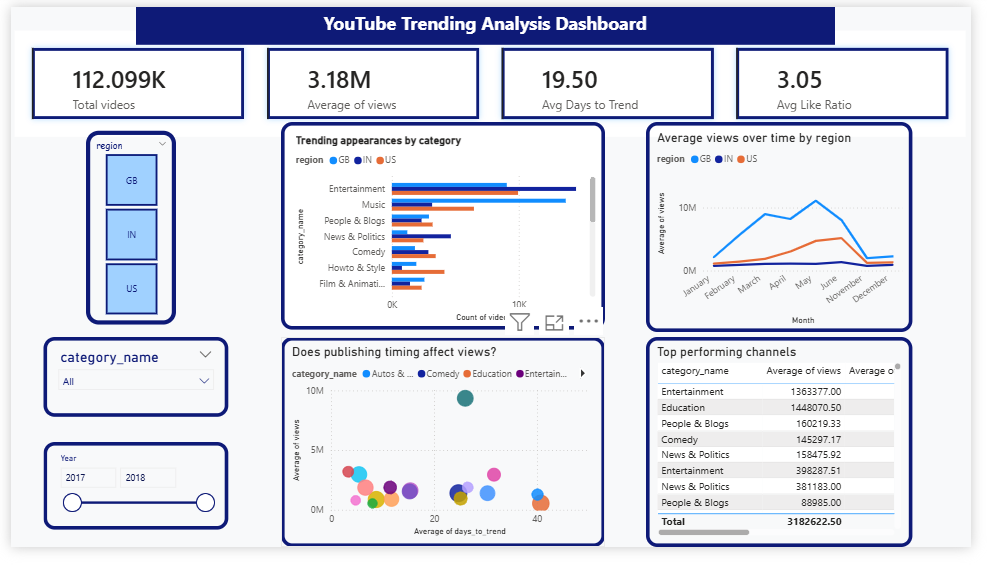

# 📊 YouTube Trending Videos Analysis

## Overview

An end-to-end data analytics project examining **120,000+ YouTube trending videos** across the **US, UK, and India** to uncover what drives viral content.

**Core questions explored:**
- What categories dominate trending?
- How quickly do videos rise to prominence?
- Which engagement signals (views, likes, comments) matter most?

---

## Key Insights

| Finding | Detail |
|---|---|
| 🎬 Entertainment & Music dominate | ~45% of all trending videos |
| 🇺🇸 US leads in average views | 2.1M vs. 800K (India) |
| 📰 News trends the fastest | ~1.2 days on average |
| 👍 High like ratio (>5%) drives comments | 3× more comments vs. low-ratio videos |

---

## Tech Stack

| Tool | Purpose |
|---|---|
| **Python** *(Pandas, Matplotlib, Seaborn)* | Data cleaning & exploratory analysis |
| **PostgreSQL** | Relational schema design & analytical queries |
| **Power BI** | Interactive dashboard & business storytelling |

---

## What I Did

1. Cleaned and transformed raw datasets using Python
2. Designed a normalized relational schema in PostgreSQL
3. Wrote analytical SQL queries to surface trends and patterns
4. Built an interactive Power BI dashboard for visual storytelling
5. Translated findings into actionable, data-backed insights

---

## Dashboard



---

## Project Structure

```
data/         → raw & cleaned datasets
notebooks/    → data cleaning & EDA (Jupyter)
sql/          → schema + analytical queries
dashboard/    → Power BI (.pbix) file
```

---

## Skills Demonstrated

- Data Cleaning & Preprocessing
- Exploratory Data Analysis (EDA)
- SQL & Relational Data Modeling
- Data Visualization & Storytelling
- End-to-End Analytics Workflow

---

## Future Improvements

- [ ] ML model to predict trending probability
- [ ] Automated ETL pipeline
- [ ] Online dashboard deployment

---

## Contact

Interested in this project or open to collaboration? Feel free to reach out!